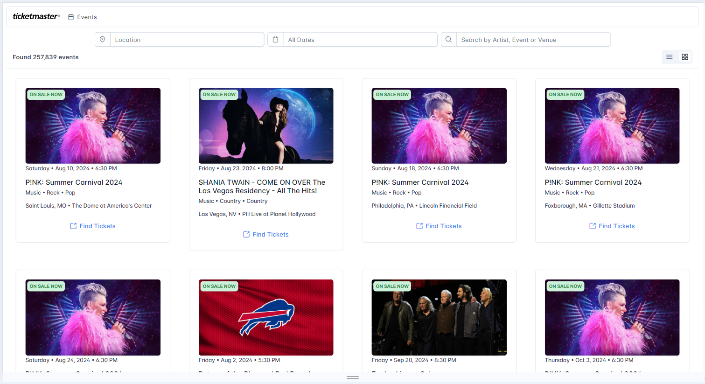

# Visory Ticketmaster Event Discovery PWA

This project consists of a Progressive Web App (PWA) built with Angular and integrated with the Ticketmaster Discovery API.

## Table of Contents
- [Prerequisites](#prerequisites)
- [Instalation](#instalation)
- [Running](#running)
- [Build](#build)
- [Deployment](#deployment)
- [Usage](#usage)
- [License](#license)

### Prerequisites

Ensure you have the following installed:

- [Node.js](https://nodejs.org/) (version 20.12.0 or later)
- [npm](https://www.npmjs.com/) (usually comes with Node.js, or version 10.5.0)

## Instalation

To get started with the Visory Ticketmaster Event Discovery PWA, follow these steps to set up your local development environment:

1. **Clone the repository:**

    ```bash
    git clone https://github.com/jefmenegazzo/visory-ticketmaster-event-discovery
    ```

2. **Navigate to the project directory:**

    ```bash
    cd visory-ticketmaster-event-discovery
    ```

3. **Install the dependencies:**

    ```bash
    npm install
    ```

## Running

To run the Angular project locally and start the development server, follow these steps:

1. **Run the application:**

    ```bash
    ng serve
    ```

    This will start the development server. You can view the application by navigating to `http://localhost:4200/` in your web browser.

## Build

To build the Angular project for production, follow these steps:

1. **Build the project:**

    To create a production build, run:

    ```bash
    ng build --configuration=production
    ```

    This command will compile the application and place the build artifacts in the `dist/` directory. The `--configuration=production` flag optimizes the build for production, including enabling Ahead-of-Time (AOT) compilation, minification, and other performance enhancements.

3. **Serve the production build:**

    If you want to test the production build locally, you can use a simple HTTP server. One way to do this is by installing `http-server` globally via npm:

    ```bash
    npm install -g http-server
    ```

    Then, navigate to the `dist/visory-ticketmaster-event-discovery` directory and start the server:

    ```bash
    cd dist/visory-ticketmaster-event-discovery
    http-server
    ```

    By default, `http-server` will serve the content at `http://localhost:8080/`. You can access the application in your web browser at this address.

## Deployment

To deploy your Angular project to a production environment, you can use the github pages with [angular-cli-ghpages library](https://github.com/angular-schule/angular-cli-ghpages) or have an account in [Vercel](https://vercel.com/) and importing the repository into the plataform to deploy.

1. **Deploy using GitHub Pages:**

   You can use the [angular-cli-ghpages](https://github.com/angular-schule/angular-cli-ghpages) library to deploy your Angular application to GitHub Pages. Follow these steps:

   - Install the library globally if you haven't already:

     ```bash
     npm install -g angular-cli-ghpages
     ```

   - Build the project for production:

     ```bash
     ng build --configuration=production
     ```

   - Deploy to GitHub Pages:

     ```bash
     npx angular-cli-ghpages --dir=dist/visory-ticketmaster-event-discovery/browser
     ```

   This will deploy the contents of the `dist/visory-ticketmaster-event-discovery/browser` directory to the `gh-pages` branch of your GitHub repository.

2. **Deploy using Vercel:**

   Alternatively, you can deploy your project using [Vercel](https://vercel.com/). Follow these steps:

   - Create a Vercel account if you don't have one.
   - Import your repository into the Vercel platform.
   - Vercel will automatically build and deploy your application based on the configuration in your repository.

# Usage

The applications is deployed and can be accessed in the following links:

- [Github Pages](https://jefmenegazzo.github.io/visory-ticketmaster-event-discovery)
- [Vercel](https://visory-ticketmaster-event-discovery.vercel.app/)

The application is fully responsible, and can run in smartphone, tablets and desktop environments.

<div align="center">
    
</div>

<div align="center">
    
</div>

## License

This project is licensed under the MIT License.
